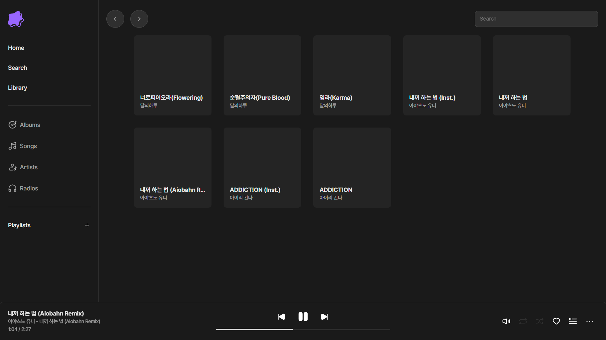

 

  <h3>   </h3>
  
  <h3>Tamaya, Self-hosted music streaming application</h3>

## About
Tamaya is a fast, lightweight self-hosted music streaming application that supports various audio formats with simple interface.

Since this project is part of my learning process, there may be many areas that need improvement. I have little experience doing backend development with Python, also this is my first time using JavaScript and Vue.js.

Feedback is always welcome!

## Documentation

## Installation

## Features