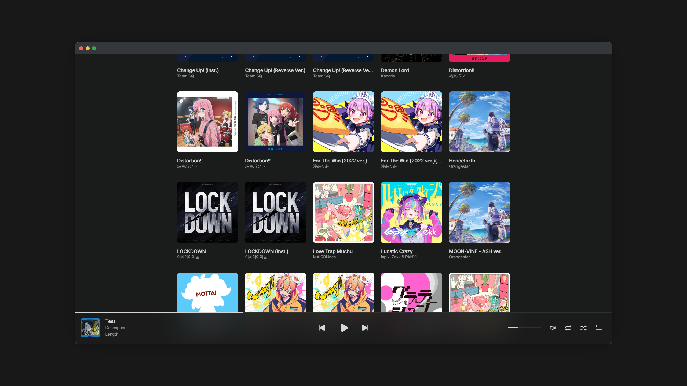

  

# mixel-music 

**mixel-music** is an open-source, self-hosted music streaming application developed with Python and Svelte. It offers fast performance, a simple yet attractive UI, and broad device compatibility, ensuring a consistent music experience across various platforms.

* Since this project is part of my learning process, there may be many areas that need improvement.  
  * This is my first time using JavaScript / TypeScript and Svelte. Also, I have little experience doing backend development using Python.
* As I'm focusing on preparing for the CSAT this year, more time will be dedicated to my studies. Therefore, the application's completion might face delays until at least the end of the year.

<!-- 
## Features

## Installation

## Documentation -->