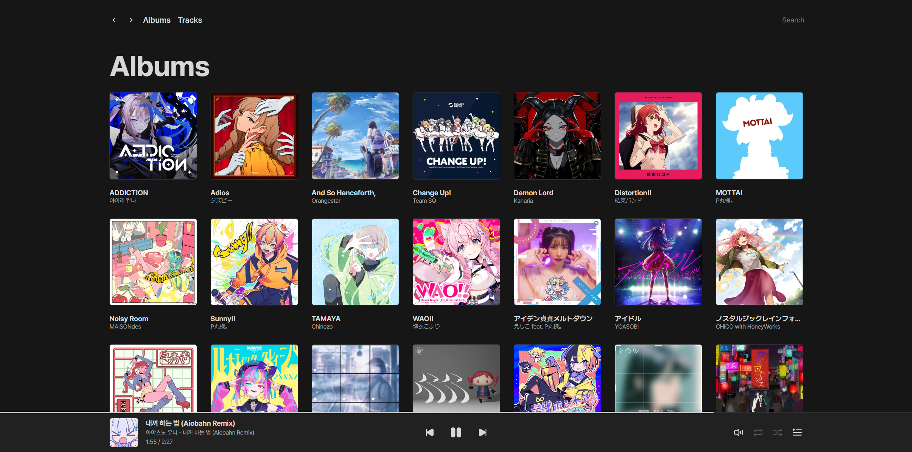

 

  
  
    
  

## mixel-music
An open-source, self-hosted music streaming app, developed with Python and Vue.js, provides fast performance, simple UI, and wide device support for a consistent music experience across platforms.

- Since this project is part of my learning process, there may be many areas that need improvement. I have little experience doing backend development. Also, this is my first time using JavaScript and Vue.js.
- As I'm focusing on preparing for the CSAT this year, more time will be dedicated to my studies. Therefore, the application's completion might face delays until at least the end of the year.

## Features

## Getting Started

## Documentation

## Screenshots

  

