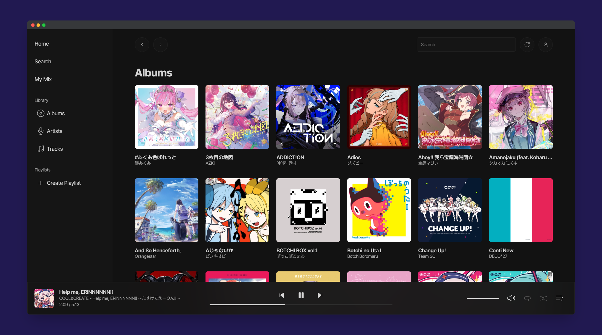

# mixel-music 
 

> [!NOTE]
> **As I’m focusing on preparing for the CSAT (Korean SAT) in November 2024, I will need to dedicate more time to my studies. Therefore, the development may be delayed until then.**

**mixel-music** is an open-source, self-hosted music streaming application developed with Python and Svelte. It offers fast performance, a simple yet attractive UI, and broad device compatibility, ensuring a consistent music experience across various platforms.

* This is my first time using JavaScript, TypeScript and Svelte. Also, I have little experience doing backend development using Python.
  * There may be many areas that need improvement. Feedback is always welcome.

<!--
## Features

## Installation

## Documentation
-->
