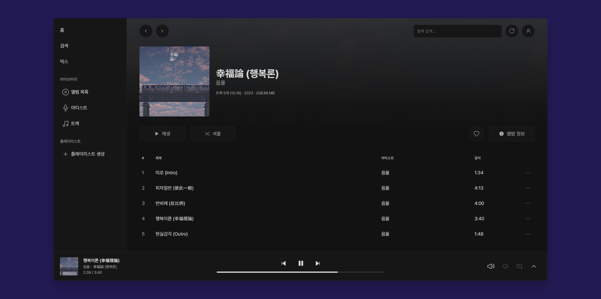

  
  <h3 align="center">mixel-music</h3>

## Introduction
  

> [!IMPORTANT]
> I’m currently preparing for the CSAT (Korean SAT), which is coming up on November 14, 2024. I’ll need to focus more on studying, and there might be some delays in development until then.

**mixel-music** is an open-source, self-hosted music streaming application built with Python and Svelte. It offers fast performance, simple yet attractive design across multiple browsers and devices.
* This is my first time working with JavaScript, TypeScript, and Svelte, and I’m still pretty new to backend development with Python.
  * So there may be many areas that need improvement. Feedback is always welcome.

## Screenshots

